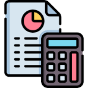

# 1. Fiscal Localization and Fiscal Year

- **Fiscal Localization**: Country-specific accounting rules and tax structures (e.g., GST for India).
- **Fiscal Year**: Defines the accounting start and end dates.
  Example: **April to March** (India), **January to December** (US/Europe).
  
---

# 2. Chart of Accounts (CoA)

- The Chart of Accounts is a **list of all accounts** used to record financial transactions in your company.
- Each account belongs to a specific **account type**, which determines where it appears in reports (Balance Sheet or Profit & Loss).
- It forms the backbone of your accounting setup in Odoo.

## 1. Balance Sheet Accounts

### Assets – What your business owns / બિઝનેસ પાસે શું છે
  - Assets are all the things that your business has or controls that have value.
  - Examples: Bank balance, Inventory, Machinery, Accounts Receivable , Office buildings, Vehicles, Product stock
	    
  - In Odoo, asset-related account types include:
    - **Receivable** 
      - Whenever you create a customer invoice (Draft), Odoo puts the amount in Receivable account until payment is made(paid).
      - (customers owe you / ગ્રાહક પાસેથી મળવાનું બાકી)

    - **Bank and Cash**
    - **Current Assets**
      - All assets that can be converted into cash or used within 1 year
      ```
      Inventory – stock you will sell
      Advance to Vendor – you paid money in advance
      Employee Advance – employee owes the company
      Prepaid Rent or Insurance – paid for future use
      ```
      - પૈસા આપ્યા પણ પાછા મળી જશે (vendor advance), અથવા પૈસા નથી પણ કિંમત છે (stock), એટલે તે Current Asset છે.
	
    - **Non-current Assets**
    - **Prepayments**
    - **Fixed Assets**
    
### Liabilities - What your business owes to others / બિઝનેસે બીજાને શું આપવાનું છે
  - Liabilities are what your company needs to pay to others — debts and obligations.
  - These are things you have to pay later – so they’re called liabilities.
  - Examples: Vendor bills (Accounts Payable), Loans, Tax payable (e.g., GST Payable), Salaries payable, Credit card dues
	
  - In Odoo, liability-related account types include:
    - **Payable**
    - **Credit Card**
    - **Current Liabilities**
    - **Non-current Liabilities**

### Equity - What’s left for the owner / માલિકીનો હિસ્સો
  - Simple formula:
    - Equity = Assets - Liabilities
  - Example:
    - Equity (₹70,000) = Assets (₹1,00,000) - Liabilities (₹30,000)
     
  - In Odoo, equity-related account types include:
    - **1. Equity**
    
    - **2. Current Year Earnings** 
           - Holds current year net profit/loss
           - **⚠️ Important Note**
               - This is a required account in Odoo.
               - Never create multiple accounts of this type.
               - Do not update this account manually

## 2. Profit and Loss Accounts

### Income 
  - **Income**
  - **Other Income**
  - e.g. (Sales)

### Expenses 
  - **Cost of Revenue**
  - **Depreciation**
  - **Expenses**
  - e.g. (Purchase, Inventory Loss, Internal Expenses)

### Other
  - **Off-Balance Sheet**

---

# 3. Taxes

- Taxes calculate **GST/VAT** automatically on invoices and bills.
- Odoo uses tax records to apply the correct tax percentage and post to the correct tax accounts.

- Sales 
  - Current Liabilites [Tax Receive]

- Purchase 
  - Current Assets [Tax Paid]

---

# 4. Bank Accounts (Optional)

If your company uses banks for transactions, you should add your bank accounts in Odoo.

---

# 5. Journal

- Sales Journal
  - [Default Account] : Income 
  - Receivable 

- Purchase Journal
  - [Default Account] : Expenses
  - Payable

- Cash Journal
  - [Cash Account] : Bank and Cash 
  - [Suspense Account] : Current Assests
  - [Profit Account] : Income 
  - [Loss Account] : Expenses 

- Bank Journal
  - [Bank Account] : Bank and Cash 
  - [Suspense Account] : Current Assests 

- Miscellaneous
  - [Default Account]

---

# 6. Invoice / Bill

To properly record invoices or vendor bills in Odoo, you need the following key accounts and journals:

Required:
- **Sales Journal** → Income Account
- **Bank Journal / Cash Journal** → Bank or Cash Account
- **Receivable and Payable Accounts** → Used to track outstanding amounts

When you **create** a customer invoice, it affects your **Assets (Receivable)** and **Income**.

```
	Account 		| Debit | Credit
Account Receivable (Customer) 	| 100.00|   -
Income (from Sales Journal) 	|   - 	| 100.00
```
- **Effect**:
  - Increases **Assets** (Receivable – money customer owes you)
  - Increases **Income**

**Status: Paid via Bank**

When payment is **received**, the receivable is cleared, and money is added to your **Bank**.
```
	Account 		| Debit | Credit
Bank Account (from Bank Journal)| 100.00| -
Account Receivable (Customer) 	| - 	| 100.00
```
- **Effect**:
  - Increases **Bank** balance
  - Decreases **Receivable**

---

> 🔁 The same logic applies for Vendor Bills:
> - Uses **Payable** instead of **Receivable**
> - Uses **Expense** instead of **Income**


- **Example 1:**
	    ```
	    Invoice (Post): Journal 1
	    Debit   | Credit
	    ------------------------
	    100.00  |        -        ← Receivable (From Contect)
	      -     |    100.00       ← Income (From Sales Journal)

	    Create Payment
	    Invoice (In Payment): Journal 2
	    Debit   | Credit
	    ------------------------
	    100.00  |        -        ← Current Assets/Outstanding Receipts (From Bank Journal/Setting Configuration)
	      -     |    100.00       ← Receivable (From Contect)
	    
	    Bank Reconciliation: Journal 3 (Invoice Paid)
	    Debit   | Credit
	    ------------------------
	      	-   |   100.00       ← Current Assets/Outstanding Receipts (From Bank Journal/Setting Configuration)
	     100.00 |     -          ← Bank and Cash (From Bank Journal)
	    ```
- **Example 2:**
	    ```
	    Invoice (Post): Journal 1
	    Debit   | Credit
	    ------------------------
	    100.00  |        -        ← Receivable (From Contect)
	      -     |    100.00       ← Income (From Sales Journal)

	    Create Bank Reconciliation: Journal 2 (Invoice Paid)
	    Debit   | Credit
	    ------------------------
	      	-   |   100.00       ← Receivable (From Contect)
	     100.00 |     -          ← Bank and Cash (From Bank Journal)
	    ```
- **Example 3:**
	    ```
	    Invoice (Post): Journal 1
	    Debit   | Credit
	    ------------------------
	    100.00  |        -        ← Receivable (From Contect)
	      -     |    100.00       ← Income (From Sales Journal)

	    - Configure Outstanding Receipts and Payment account to set Bank Account
	    Create Payment: Journal 2 (Invoice Paid)
	    Debit   | Credit
	    ------------------------
	      	-   |   100.00       ← Receivable (From Contect)
	     100.00 |     -          ← Bank and Cash (From Bank Journal)
	    ```
---

# 7. Reconciliation

- In odoo 18: https://youtube.com/playlist?list=PLGcOZ-0xnkZ7HhTHfEA1Nf0o6GNUnfZda&si=IZNrT2f0TcIwztnt

---
    
Assests (Things the company owns)                       =   Liabilites (What the company owes)                  +   Equity (Owner’s interest in the company)

Bank and Cash                                                                                                           Unallocated Earnings (or Retained Earnings)
•   Increases with Sales (+)                                                                                            •   Increases with Sales (+)
•   Decreases with Purchases (-)                                                                                        •   Decreases with Purchases (-)

Receivable (Accounts Receivable)                            Payable (Accounts Payable)
•   Increases when Invoice is posted (Pending Payment)          •   Increases when a Bill is posted (Pending Payment)
•   Decreases when Payment is received                          •   Decreases when Payment is made

Current Assests                                             Current Liabilities
•   Increases when Tax is Receivable                            •   Increases when Tax is Payable
•   Decreases when Tax Return                                   •   Decreases when Tax Return 

---

Net Profit = Expenses (Purchase +) - Income (Sales +)





---

When You Purchase a Product
    Debit:  Stock Valuation Account (200001 Closing Stock)
    Credit: Stock Input Account     (200002 Stock Interim (Received))

When You Sell a Product
    Credit: Stock Valuation Account (200001 Closing Stock)
    Debit:  Stock Output Account    (200003 Stock Interim (Delivered))

---

Increases product cost
    Credit: Expense Account         (600001 Purchase)
    Debit:  Stock Valuation Account (200001 Closing Stock)

Decreases product cost
    Credit: Stock Valuation Account (200001 Closing Stock)
    Debit:  Expense Account         (600001 Purchase)

---

Create customer invoice
    Credit: Income Account (500001 Sales Account)
    Debit:                 (Trade Receivables)

Create vendor bill
    Credit:                (Trade Payables)
    Debit: Expense Account (600001 Purchase)


